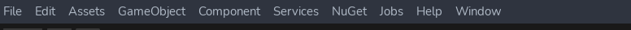

# Willowish-Unity

A project component for Masters degree in Mobile Computing, contains Mixed Reality biz processes.

*Warning:
This project unfortunately is restricted to windows due to VueForia dependancy, If you wish to change this contact vueforia and let them know!*

## Instalation

*Note: Due to using git and different environments to develop this package you will find a lot of instability and errors! Do not worry thats just Unity3D being a wuss*
### Cloning!
You should start by git cloning this repo!

```shell
git clone https://github.com/Imeguras/willowish_unity
```

### Before opening it on Unity:
Get com.ptc.vuforia.engine-10.19.3.tgz, and place it in Packages, The file was too big and **someone** was too lazy to configure git LFS

Now open it with Unity, the most adequate version should be 2022.3.10f1.
### Vuforia dependancy
Next install Vueforia, you might find the download to be suprisingly fast, this is due to the library being half mutilated as to not make the download of the project enormously slow.

### Nugget package manager for unity 

Next you should fetch [nuget for unity](https://github.com/GlitchEnzo/NuGetForUnity) if you find that the NuGet tab is missing:



The easiest way to install it is through package manager:
tl;dr : `https://github.com/GlitchEnzo/NuGetForUnity.git?path=/src/NuGetForUnity`
<details>
<summary> If you are unaware of how to install git urls through package manager, quote:</summary>

```md
#### Unity 2019.3 or newer

1. Open Package Manager window (Window | Package Manager)
2. Click `+` button on the upper-left of a window, and select "Add package from git URL..."
3. Enter the following URL and click `Add` button

https://github.com/GlitchEnzo/NuGetForUnity.git?path=/src/NuGetForUnity

> ***NOTE:*** To install a concrete version you can specify the version by prepending #v{version} e.g. `#v2.0.0`. For more see [Unity UPM Documentation](https://docs.unity3d.com/Manual/upm-git.html).
```

</details>

### Nugget Dependancies 

Now you should be able to install the nugget dependencies, youll need :
* WebSocketSharp-netstandard(1.0.1)
* NetTopologySuite(2.5.0)
* NetTopologySuite.IO.GeoJSON4STJ(4.0.0)
* System.Text.Json(8.0.0)

<details>
<summary>Configuring the websocket connections</summary>

You should copy and paste `Assets/Scripts/WebSockets/ws_config_EXAMPLE.xml` into a new file called `ws_config.xml`, point it to the backend(if you are outside the project unfortunately its over, theres nothing you can do about it) using the correct url.
If you arent running it in localhost, ***use wss*** if not ***you should use ws***.
</details>


### Setup Licenses VueForia
TODO: 
